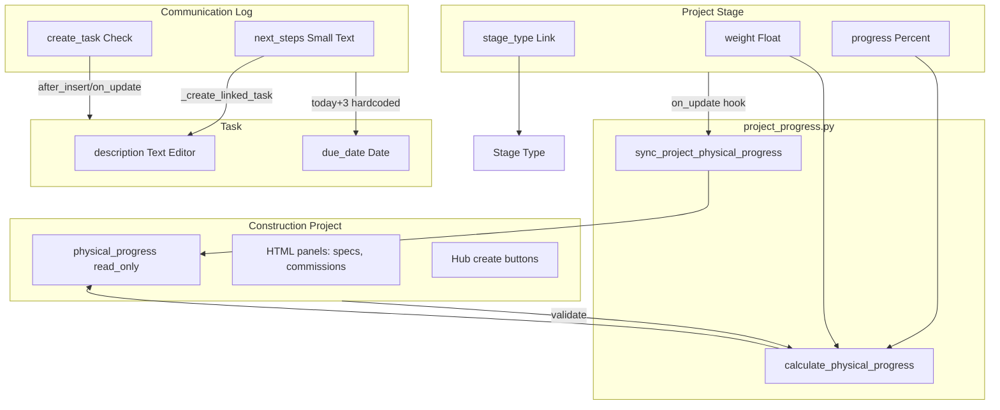

# Diagnóstico — Hub Visual + Etapas + Communication Log

**Data:** 2026-06-05  
**App:** `engenharia`  
**Escopo:** somente diagnóstico — nenhum arquivo de código alterado.

---

## Seção 1 — Project Stage (estado atual)

### 1.1 Schema

```bash
cat engenharia/engenharia/doctype/project_stage/project_stage.json | python3 -c "
import json, sys
d = json.load(sys.stdin)
print('naming_rule:', d.get('naming_rule'))
print('autoname:', d.get('autoname'))
print('istable:', d.get('istable'))
print()
for f in d.get('fields', []):
    print(f'{f[\"fieldname\"]:30s} {f[\"fieldtype\"]:15s} {f.get(\"options\",\"\"):30s} reqd={f.get(\"reqd\",0)} read_only={f.get(\"read_only\",0)}')
"
```

**Saída:**

```
naming_rule: Expression (old style)
autoname: format:STGE-{YYYY}-{####}
istable: None

project                        Link            Construction Project           reqd=1 read_only=0
stage_type                     Link            Stage Type                     reqd=1 read_only=0
col_break_1                    Column Break                                   reqd=0 read_only=0
status                         Select          Não iniciada
Em andamento
Concluída reqd=0 read_only=0
progress                       Percent                                        reqd=0 read_only=0
weight                         Float                                          reqd=0 read_only=0
stage_value                    Currency                                       reqd=0 read_only=0
order                          Int                                            reqd=0 read_only=0
title                          Data                                           reqd=0 read_only=1
sec_dates                      Section Break                                  reqd=0 read_only=0
start_date                     Date                                           reqd=0 read_only=0
expected_end                   Date                                           reqd=0 read_only=0
actual_end                     Date                                           reqd=0 read_only=0
```

### 1.2 Controller

```bash
cat engenharia/engenharia/doctype/project_stage/project_stage.py
```

```python
import frappe
from frappe import _
from frappe.model.document import Document
from frappe.utils import flt

from engenharia.titles import apply_title_post_insert, recompose_title


class ProjectStage(Document):
	def validate(self):
		if flt(self.progress) < 0 or flt(self.progress) > 100:
			frappe.throw(_("Avanço deve estar entre 0 e 100."))
		if self.status == "Concluída" and flt(self.progress) < 100:
			self.progress = 100
		if self.status == "Não iniciada" and flt(self.progress) > 0:
			self.progress = 0
		recompose_title(self)

	def after_insert(self):
		apply_title_post_insert(self)
```

### 1.3 JS (se existir)

```bash
ls -la engenharia/public/js/project_stage* 2>/dev/null || echo "Nenhum JS encontrado"
cat engenharia/public/js/project_stage*.js 2>/dev/null || true
```

**Saída:**

```
Nenhum JS encontrado
```

**Nota:** existe arquivo vazio no path padrão Frappe do DocType:

```bash
ls -la engenharia/engenharia/doctype/project_stage/*.js
# -rw-rw-r-- 1 frappe frappe 0 Jun  6 16:42 engenharia/engenharia/doctype/project_stage/project_stage.js
```

Conteúdo de `project_stage.js`: *(arquivo vazio — 0 bytes)*

### 1.4 Perguntas a responder

| Pergunta | Resposta |
|----------|----------|
| O campo `progress` existe? Qual fieldtype? É read_only? | **Sim.** Fieldtype `Percent`. **Não** é read_only (`read_only=0`). Editável manualmente. |
| Existe campo `weight`? `planned_qty`? `executed_qty`? `uom`? | **`weight`:** sim, `Float`, default implícito `"1"` no JSON. **`planned_qty`, `executed_qty`, `uom`:** **não existem.** |
| O progress do Construction Project é calculado a partir dos stages? Como? | **Sim.** Média ponderada: `Σ(progress × weight) / Σ(weight)` em `engenharia/project_progress.py`. Campo destino: `physical_progress` (read_only) no Construction Project. |
| Existe algum `on_update`/`on_trash` no stage que atualiza o pai? | **`on_update`:** sim, via `hooks.py` → `engenharia.project_progress.on_project_stage_update` → `sync_project_physical_progress`. **`on_trash` / `after_insert`:** **não** — inserir ou excluir etapa **não** dispara sync automático do pai (só recalcula ao salvar a etapa existente ou ao validar o Construction Project). |

**Módulo de cálculo (`engenharia/project_progress.py`):**

```python
"""Cálculo de avanço físico global da obra a partir das etapas."""

from __future__ import annotations

import frappe
from frappe.utils import flt


def calculate_physical_progress(project: str) -> float:
	stages = frappe.get_all(
		"Project Stage",
		filters={"project": project},
		fields=["progress", "weight"],
		limit=500,
	)
	if not stages:
		return 0

	total_weight = sum(flt(stage.weight) or 1 for stage in stages)
	if not total_weight:
		return 0

	weighted_sum = sum(flt(stage.progress) * (flt(stage.weight) or 1) for stage in stages)
	return round(weighted_sum / total_weight, 1)


def sync_project_physical_progress(project: str | None) -> float:
	if not project:
		return 0

	progress = calculate_physical_progress(project)
	frappe.db.set_value(
		"Construction Project",
		project,
		"physical_progress",
		progress,
		update_modified=False,
	)
	return progress


def on_project_stage_update(doc, method=None):
	if doc.project:
		sync_project_physical_progress(doc.project)
```

---

## Seção 2 — Stage Type (cadastro auxiliar)

```bash
cat engenharia/engenharia/doctype/stage_type/stage_type.json | python3 -c "
import json, sys
d = json.load(sys.stdin)
print('naming_rule:', d.get('naming_rule'))
for f in d.get('fields', []):
    print(f'{f[\"fieldname\"]:30s} {f[\"fieldtype\"]:15s}')
"
```

**Saída:**

```
naming_rule: By fieldname
stage_name                     Data           
default_order                  Int            
```

**JSON completo:**

```json
{
 "autoname": "field:stage_name",
 "fields": [
  {
   "fieldname": "stage_name",
   "fieldtype": "Data",
   "label": "Nome da Etapa",
   "reqd": 1,
   "unique": 1
  },
  {
   "default": "0",
   "fieldname": "default_order",
   "fieldtype": "Int",
   "label": "Ordem Padrão"
  }
 ],
 "name": "Stage Type",
 "naming_rule": "By fieldname",
 "quick_entry": 1,
 "title_field": "stage_name"
}
```

| Pergunta | Resposta |
|----------|----------|
| Quais campos existem além do name? | `stage_name` (Data, reqd, unique) e `default_order` (Int, default 0). |
| Existe algum campo de `default_weight` ou `sort_order`? | **`default_weight`:** **não.** **`sort_order`:** **não** — o equivalente é `default_order`. |

---

## Seção 3 — Construction Project (hub central)

### 3.1 Schema — foco em tabs e campos HTML

```bash
cat engenharia/engenharia/doctype/construction_project/construction_project.json | python3 -c "
import json, sys
d = json.load(sys.stdin)
print('=== TABS ===')
for f in d.get('fields', []):
    if f['fieldtype'] in ('Tab Break', 'Section Break', 'Column Break'):
        print(f'{f[\"fieldtype\"]:15s} {f[\"fieldname\"]:30s} label={f.get(\"label\",\"\")}')
    if f['fieldtype'] == 'HTML':
        print(f'  HTML FIELD: {f[\"fieldname\"]:30s} label={f.get(\"label\",\"\")}')
print()
print('=== CAMPO PROGRESS ===')
for f in d.get('fields', []):
    if 'progress' in f['fieldname']:
        print(f'{f[\"fieldname\"]:30s} {f[\"fieldtype\"]:15s} read_only={f.get(\"read_only\",0)} options={f.get(\"options\",\"\")}')
print()
print('=== CAMPOS TABLE ===')
for f in d.get('fields', []):
    if f['fieldtype'] == 'Table':
        print(f'{f[\"fieldname\"]:30s} options={f.get(\"options\",\"\")}')
"
```

**Saída:**

```
=== TABS ===
Column Break    col_break_1                    label=
Section Break   sec_dates                      label=Datas
Section Break   sec_address                    label=Endereço da Obra
Column Break    col_break_2                    label=
Section Break   sec_details                    label=Detalhes
  HTML FIELD: commission_summary_panel       label=Resumo de comissões
Section Break   sec_technical                  label=Responsabilidade Técnica
Column Break    col_break_technical            label=
Section Break   sec_budget                     label=Orçamento
Section Break   sec_specs                      label=Especificações Técnicas
  HTML FIELD: specs_help                     label=Itens técnicos
  HTML FIELD: spec_preview_panel             label=Prévia das especificações
  HTML FIELD: spec_items_summary_panel       label=Especificações da Obra
Section Break   sec_obs                        label=Observações

=== CAMPO PROGRESS ===
physical_progress              Percent         read_only=1 options=

=== CAMPOS TABLE ===
budget_revisions               options=Project Budget Revision
```

**Observação:** **não há `Tab Break`** no formulário — apenas `Section Break` / `Column Break`. O hub visual com abas ainda não existe.

### 3.2 Controller — métodos relacionados a progress e stages

```bash
cat engenharia/engenharia/doctype/construction_project/construction_project.py
```

```python
import frappe
from frappe.model.document import Document
from frappe.utils import flt, today

from engenharia.titles import apply_title_post_insert, get_customer_name, recompose_title


def format_construction_project_link_label(doc=None, project_name=None):
	"""Label amigável para Link / autocomplete de obra."""
	if doc is None and project_name:
		doc = frappe.db.get_value(
			"Construction Project",
			project_name,
			["name", "title", "customer", "city", "status"],
			as_dict=True,
		)
	if not doc:
		return project_name or ""
	title = (doc.get("title") or doc.get("name") or "").strip()
	if title:
		return title
	customer = get_customer_name(doc.get("customer"))
	parts = [p for p in (customer, doc.get("city")) if p]
	return " - ".join(parts) if parts else doc.get("name") or ""


@frappe.whitelist()
@frappe.validate_and_sanitize_search_inputs
def construction_project_query(
	doctype: str,
	txt: str,
	searchfield: str,
	start: int,
	page_len: int,
	filters,
) -> list[tuple[str, str]]:
	frappe.has_permission("Construction Project", "read", throw=True)
	# ... query implementation ...
	return [(row.name, format_construction_project_link_label(doc=row)) for row in rows]


@frappe.whitelist()
def get_technical_items_for_select() -> list[dict]:
	# ...

@frappe.whitelist()
def create_project_item(
	project: str,
	technical_item: str,
	instance_label: str | None = None,
	stage: str | None = None,
) -> str:
	# ...

@frappe.whitelist()
def create_budget_revision(project: str) -> dict:
	# ...


class ConstructionProject(Document):
	def validate(self):
		recompose_title(self)
		self._sync_physical_progress()
		self._seed_initial_budget_revision()

	def _seed_initial_budget_revision(self) -> None:
		if self.budget_revisions:
			return
		# ...

	def _sync_physical_progress(self):
		from engenharia.project_progress import calculate_physical_progress

		if self.is_new() or not self.name:
			self.physical_progress = 0
			return
		self.physical_progress = calculate_physical_progress(self.name)

	def after_insert(self):
		apply_title_post_insert(self)
```

**Dashboard de links (satélites no formulário Frappe nativo):**

```python
# engenharia/engenharia/doctype/construction_project/construction_project_dashboard.py
from frappe import _


def get_data():
	return {
		"internal_links": {
			"Engineering Contract": "project",
			"Payment": "project",
			"Work Cost": "project",
			"Subcontract": "project",
			"Reimbursable Expense": "project",
			"Deadline": "project",
			"Permit": "project",
			"Task": "project",
			"Communication Log": "project",
			"Time Log": "project",
			"Construction Measurement": "project",
			"Commission": "project",
			"Project Item": "project",
			"Project Stage": "project",
		},
	}
```

### 3.3 JS do Construction Project

```bash
grep -r "Construction Project" engenharia/engenharia/hooks.py | grep doctype_js
# (sem resultados — doctype_js está comentado no hooks.py)
cat engenharia/public/js/construction_project*.js 2>/dev/null || true
find engenharia/ -name "*.js" | xargs grep -l "Construction Project" 2>/dev/null
```

**Saída `find`:**

```
engenharia/engenharia/report/work_cost_by_project/work_cost_by_project.js
engenharia/engenharia/report/project_margin/project_margin.js
engenharia/engenharia/doctype/construction_project/construction_project_list.js
engenharia/engenharia/doctype/construction_project/construction_project.js
engenharia/engenharia/doctype/communication_log/communication_log.js
engenharia/public/js/dashboard/quick_actions.js
engenharia/public/js/dashboard/operational.js
engenharia/public/js/customer_from_project.js
```

**JS principal:** `engenharia/engenharia/doctype/construction_project/construction_project.js` (527 linhas — carregado automaticamente pelo Frappe pelo path do DocType).

Trechos relevantes para hub + painéis HTML:

```javascript
frappe.ui.form.on("Construction Project", {
	refresh(frm) {
		// ...
		if (!frm.is_new()) {
			eng_refresh_spec_rollup(frm);
			eng_refresh_spec_items_summary(frm);
			eng_refresh_commission_summary(frm);
			eng_add_hub_create_buttons(frm);
			// ...
		}
	},
});

function eng_add_hub_create_buttons(frm) {
	const hub = eng_hub_defaults(frm);
	frm.add_custom_button(__("+ Contrato"), () => frappe.new_doc("Engineering Contract", hub), __("Criar"));
	frm.add_custom_button(__("+ Pagamento"), () => frappe.new_doc("Payment", hub), __("Criar"));
	frm.add_custom_button(__("+ Custo"), () => frappe.new_doc("Work Cost", { project: hub.project }), __("Criar"));
	frm.add_custom_button(__("+ Despesa reembolsável"), () => frappe.new_doc("Reimbursable Expense", hub), __("Criar"));
	frm.add_custom_button(__("+ Prazo"), () => frappe.new_doc("Deadline", hub), __("Criar"));
	frm.add_custom_button(__("+ Protocolo"), () => frappe.new_doc("Permit", hub), __("Criar"));
	frm.add_custom_button(__("+ Tarefa"), () => frappe.new_doc("Task", hub), __("Criar"));
	frm.add_custom_button(__("+ Comunicação"), () => frappe.new_doc("Communication Log", hub), __("Criar"));
	frm.add_custom_button(__("+ Horas"), () => frappe.new_doc("Time Log", hub), __("Criar"));
	frm.add_custom_button(__("+ Etapa"), () => frappe.new_doc("Project Stage", { project: hub.project }), __("Criar"));
}

function eng_refresh_spec_rollup(frm) {
	frappe.call({
		method: "engenharia.project_rollup.get_construction_project_spec_preview",
		args: { project: frm.doc.name },
		callback(r) {
			const data = r.message || {};
			if (frm.fields_dict.spec_preview_panel) {
				frm.fields_dict.spec_preview_panel.$wrapper.html(data.preview_html || ...);
			}
		},
	});
}

function eng_refresh_spec_items_summary(frm) {
	frappe.call({
		method: "engenharia.project_rollup.get_project_items_summary",
		args: { project: frm.doc.name },
		callback(r) {
			frm.fields_dict.spec_items_summary_panel.$wrapper.html(
				eng_render_spec_items_table(frm, items, data.project_total)
			);
		},
	});
}

function eng_refresh_commission_summary(frm) {
	frappe.call({
		method: "engenharia.project_rollup.get_project_commission_summary",
		args: { project: frm.doc.name },
		callback(r) { /* injeta HTML em commission_summary_panel */ },
	});
}
```

**Padrão existente de painel HTML no hub:** campos `HTML` no JSON + `frappe.call` para rollup + injeção via `$wrapper.html()`. **Não** usa classes `eng-dash-*` nem `frappe.xcall` do Painel de Obras.

---

## Seção 4 — Communication Log

### 4.1 Schema

```bash
cat engenharia/engenharia/doctype/communication_log/communication_log.json | python3 -c "
import json, sys
d = json.load(sys.stdin)
for f in d.get('fields', []):
    print(f'{f[\"fieldname\"]:30s} {f[\"fieldtype\"]:15s} options={f.get(\"options\",\"\")} reqd={f.get(\"reqd\",0)}')
"
```

**Saída:**

```
info_section                   Section Break   options= reqd=0
title                          Data            options= reqd=0
project                        Link            options=Construction Project reqd=0
customer                       Link            options=Customer reqd=1
column_break_info              Column Break    options= reqd=0
communication_date             Datetime        options= reqd=1
communication_type             Select          options=Telefone
WhatsApp
Email
Reunião Presencial
Reunião Virtual
Outro reqd=1
details_section                Section Break   options= reqd=0
subject                        Data            options= reqd=1
summary                        Text Editor     options= reqd=0
next_steps_section             Section Break   options= reqd=0
next_steps                     Small Text      options= reqd=0
create_task                    Check           options= reqd=0
task                           Link            options=Task reqd=0
```

### 4.2 Controller — foco na criação de Task

```bash
cat engenharia/engenharia/doctype/communication_log/communication_log.py
```

```python
import frappe
from frappe import _
from frappe.model.document import Document
from frappe.utils import add_days, today

from engenharia.titles import apply_title_post_insert, recompose_title


class CommunicationLog(Document):
	def validate(self):
		if not self.communication_type:
			frappe.throw(_("Tipo é obrigatório."))
		if self.project and not self.customer:
			self.customer = frappe.db.get_value("Construction Project", self.project, "customer")
		self._compose_title()

	def after_insert(self):
		apply_title_post_insert(self)
		self._create_linked_task()

	def on_update(self):
		self._create_linked_task()

	def _compose_title(self):
		recompose_title(self)

	def _create_linked_task(self):
		"""Cria Tarefa de follow-up uma única vez, se solicitado."""
		if not self.create_task or not self.next_steps or self.task:
			return

		frappe.has_permission("Task", "create", throw=True)
		task = frappe.get_doc(
			{
				"doctype": "Task",
				"subject": f"Follow-up: {self.subject}",
				"description": self.next_steps,
				"project": self.project,
				"customer": self.customer,
				"status": "A fazer",
				"due_date": add_days(today(), 3),
			}
		)
		task.insert()
		self.db_set("task", task.name)
```

**JS (`communication_log.js`):**

```javascript
frappe.ui.form.on("Communication Log", {
	refresh: function (frm) {
		var color = COMMUNICATION_TYPE_COLORS[frm.doc.communication_type] || "grey";
		if (frm.doc.communication_type) {
			frm.page.set_indicator(frm.doc.communication_type, color);
		}
		if (frm.doc.project && !frm.is_new()) {
			frm.add_custom_button(__("Ver Obra"), function () {
				frappe.set_route("Form", "Construction Project", frm.doc.project);
			});
		}
	},
});
```

### 4.3 Perguntas a responder

| Pergunta | Resposta |
|----------|----------|
| `next_steps`: qual fieldtype atual? | **`Small Text`** |
| Existe campo `follow_up_date`? | **Não** |
| Como a Task é criada? Em qual hook? | Método `_create_linked_task()` chamado em **`after_insert`** e **`on_update`**. Condições: `create_task=1`, `next_steps` preenchido, `task` ainda vazio. |
| A Task criada herda o `next_steps` como `description`? | **Sim:** `"description": self.next_steps` |
| Qual o fieldtype de `description` no Task DocType? | **`Text Editor`** — compatível com rich text; hoje recebe plain text de `Small Text`. |

**Comportamento adicional:** `due_date` da Task é **fixo** em `today() + 3 dias` — não há campo configurável no Communication Log.

---

## Seção 5 — Task

### 5.1 Schema

```bash
cat engenharia/engenharia/doctype/task/task.json | python3 -c "
import json, sys
d = json.load(sys.stdin)
for f in d.get('fields', []):
    print(f'{f[\"fieldname\"]:30s} {f[\"fieldtype\"]:15s}')
"
```

**Saída:**

```
project                        Link           
customer                       Link           
stage                          Link           
col_break_1                    Column Break   
subject                        Data           
status                         Select         
priority                       Select         
due_date                       Date           
sec_details                    Section Break  
description                    Text Editor    
col_break_2                    Column Break   
assigned_to                    Link           
completed_on                   Date           
```

| Pergunta | Resposta |
|----------|----------|
| Campo `description`: qual fieldtype? | **`Text Editor`** |
| Campo `due_date`: existe? | **Sim**, `Date`, label "Prazo" |

**Campos ausentes para herança do Communication Log:** não há `next_steps` nem `follow_up_date` dedicados na Task — apenas `description` e `due_date`.

---

## Seção 6 — Painel de Obras (referência visual)

> **Nota de nomenclatura:** o painel vive na Page `eng-dashboard` (rota `/app/eng-dashboard`), não em `page/painel*`. Backend em `engenharia/dashboard/`; facade em `engenharia/dashboard_api.py`.

### 6.1 Estrutura de arquivos do painel

```bash
find engenharia/ -path "*/page/painel*" -o -path "*/dashboard*" | grep -v __pycache__ | sort
```

**Saída:**

```
engenharia/dashboard
engenharia/dashboard/__init__.py
engenharia/dashboard/_helpers.py
engenharia/dashboard/agenda.py
engenharia/dashboard/attention.py
engenharia/dashboard/commissions.py
engenharia/dashboard/deadlines.py
engenharia/dashboard/financial.py
engenharia/dashboard/health.py
engenharia/dashboard/kpis.py
engenharia/dashboard/operational.py
engenharia/dashboard/subcontracts.py
engenharia/dashboard/timeline.py
engenharia/dashboard_api.py
engenharia/public/css/dashboard.css
engenharia/public/js/dashboard
engenharia/public/js/dashboard/attention.js
engenharia/public/js/dashboard/commissions.js
engenharia/public/js/dashboard/filters.js
engenharia/public/js/dashboard/financial.js
engenharia/public/js/dashboard/health.js
engenharia/public/js/dashboard/hero.js
engenharia/public/js/dashboard/kpis.js
engenharia/public/js/dashboard/lists.js
engenharia/public/js/dashboard/next_event.js
engenharia/public/js/dashboard/operational.js
engenharia/public/js/dashboard/quick_actions.js
engenharia/public/js/dashboard/timeline.js
engenharia/public/js/dashboard/utils.js
```

**Page shell adicional:**

```
engenharia/engenharia/page/eng_dashboard/eng_dashboard.js
engenharia/engenharia/page/eng_dashboard/eng_dashboard.json
```

### 6.2 CSS vars e design tokens usados

```bash
grep -roh 'var(--[a-zA-Z0-9_-]*)' engenharia/public/js/dashboard/ 2>/dev/null | sort -u
grep -roh 'var(--[a-zA-Z0-9_-]*)' engenharia/engenharia/page/ 2>/dev/null | sort -u
```

**JS do dashboard:** *(nenhuma ocorrência — tokens ficam no CSS)*

**CSS (`engenharia/public/css/dashboard.css` + JS inline mínimo):**

```
var(--bg-light-gray)
var(--blue-500)
var(--border-color)
var(--card-bg)
var(--control-bg)
var(--eng-dash-gap)
var(--eng-dash-radius)
var(--eng-dash-shadow)
var(--eng-dash-shadow-soft)
var(--eng-dash-shadow-strong)
var(--fg-color)
var(--gray-500)
var(--gray-600)
var(--gray-900)
var(--green-500)
var(--green-600)
var(--orange-500)
var(--orange-600)
var(--primary)
var(--purple-500)
var(--red-500)
var(--red-600)
var(--section-gap)
var(--subtle-fg)
var(--text-base)
var(--text-color)
var(--text-lg)
var(--text-muted)
var(--text-sm)
var(--text-xl)
var(--text-xs)
var(--yellow-500)
```

**Tokens customizados do painel (definidos em `dashboard.css`):**

```css
--eng-dash-shadow: 0 1px 2px color-mix(in srgb, var(--gray-900) 4%, transparent),
	0 8px 24px color-mix(in srgb, var(--gray-900) 5%, transparent);
--eng-dash-shadow-strong: ...
--eng-dash-shadow-soft: ...
--eng-dash-gap
--eng-dash-radius
```

### 6.3 Componentes visuais reutilizáveis

```bash
grep -roh 'eng-dashboard-[a-zA-Z0-9_-]*' engenharia/ 2>/dev/null | sort -u
# (0 ocorrências — prefixo real é eng-dash-)
grep -roh 'eng-dash-[a-zA-Z0-9_-]*' engenharia/ 2>/dev/null | sort -u
```

**212 classes `eng-dash-*`**, incluindo:

```
eng-dash-root, eng-dash-hero, eng-dash-kpi, eng-dash-kpi-grid, eng-dash-kpi--blue|green|orange|...
eng-dash-progress, eng-dash-progress__bar
eng-dash-finance-donut, eng-dash-fluxo-card, eng-dash-fluxo-card--success|warning|info
eng-dash-timeline, eng-dash-timeline-item, eng-dash-list, eng-dash-section
eng-dash-atencao-card, eng-dash-saude-ring, eng-dash-empty-state
eng-dash-op-row, eng-dash-op-progress
... (212 total)
```

**Hub Construction Project usa prefixo diferente:** `eng-spec-*`, `eng-commission-*` (Bootstrap table/btn), **não** `eng-dash-*`.

### 6.4 Padrão de chamada de dados (como o painel busca dados do backend)

**Endpoints whitelisted (`dashboard_api.py`):**

```python
@frappe.whitelist()
def get_dashboard_data(
	limit_start: int = 0,
	limit: int | None = None,
	limit_page_length: int | None = None,
	period_days: int = 7,
	periodo_dias: int | None = None,
	list_limit: int = 5,
	list_limits: dict | str | None = None,
) -> dict:
	frappe.has_permission("Construction Project", "read", throw=True)
	return _get_dashboard_data(...)

@frappe.whitelist()
def mark_payment_received(payment_name: str, received_date: str | None = None):
	frappe.has_permission("Payment", "write", throw=True)
	return _mark_payment_received(payment_name, received_date)
```

**Chamadas no JS do painel:**

```javascript
// eng_dashboard.js — bootstrap
frappe.xcall("engenharia.dashboard_api.get_dashboard_data", {
	period_days: page.period_days,
	list_limits: page.eng_dash_list_limits,
})

// lists.js — ação operacional
frappe.call({
	method: "engenharia.dashboard_api.mark_payment_received",
	args: { payment_name: name },
})
```

**Contrato:** facade única `engenharia.dashboard_api.get_dashboard_data` → orquestrador `engenharia.dashboard.get()`. Submódulos (`kpis.py`, `financial.py`, etc.) **não** são chamados direto do front.

**Para hub por obra:** será necessário **novo** endpoint whitelisted filtrado por `project` (ex.: `get_project_hub_data(project)`) — hoje o dashboard é **escritório-wide**, não por Construction Project.

---

## Seção 7 — hooks.py (contexto completo)

```bash
cat engenharia/hooks.py
```

<details>
<summary>hooks.py completo (340 linhas)</summary>

```python
app_name = "engenharia"
# ...

fixtures = [
	{"dt": "Workspace", "filters": [["name", "=", "Engenharia"]]},
	{"dt": "Notification", "filters": [["name", "in", [
		"Engenharia - Prazo vencendo",
		"Engenharia - Parcela vencida",
		"Engenharia - Protocolo expirando",
		"Engenharia - Tarefa atrasada",
	]]]},
	{"dt": "Print Format", "filters": [["name", "in", [
		"Engenharia - Contrato de Obra",
		"Engenharia - Recibo de Pagamento",
		"Engenharia - Orçamento da Obra",
	]]]},
	{"dt": "Custom Field", "filters": [["dt", "=", "Event"], ["fieldname", "like", "custom_source%"]]},
	{"dt": "Role", "filters": [["name", "in", ["Engenharia User", "Engenharia Manager"]]]},
	{"dt": "Kanban Board", "filters": [["name", "=", "Engenharia Obras"]]},
]

app_include_css = [
	"/assets/engenharia/css/list_filters.css",
	"/assets/engenharia/css/reports.css",
]
app_include_js = [
	"/assets/engenharia/js/masks.js",
	"/assets/engenharia/js/list_nav.js",
	"/assets/engenharia/js/list_filters.js",
	"/assets/engenharia/js/customer_from_project.js",
	"/assets/engenharia/js/documents_placeholders.js",
	"/assets/engenharia/js/timer_global.js",
	"/assets/engenharia/js/reports_common.js",
]

# doctype_js — COMENTADO (Frappe carrega JS do path doctype/*.js automaticamente)

importable_doctypes = ["Customer", "Supplier", "Construction Project", "Public Agency"]

standard_queries = {
	"Construction Project": "engenharia.engenharia.doctype.construction_project.construction_project.construction_project_query",
}

after_install = "engenharia.setup.install.after_install"
after_migrate = [
	"engenharia.setup.reinstall_child_doctypes.reinstall_child_doctypes",
	"engenharia.setup.roles.seed_roles",
	"engenharia.setup.install.ensure_event_custom_fields",
	"engenharia.setup.permissions.ensure_engenharia_permissions",
	"engenharia.setup.seed.ensure_seed_data",
	"engenharia.setup.translations.ensure_doctype_translations",
	"engenharia.setup.sidebar.ensure_engenharia_sidebar",
	"engenharia.setup.reports.ensure_engenharia_reports",
	"engenharia.setup.print_formats.ensure_engenharia_print_formats",
	"engenharia.setup.workspace.ensure_engenharia_workspace",
]

doc_events = {
	"Engineering Contract": {"on_update": "engenharia.financial.sync_payments_hook"},
	"Reimbursable Expense": {"on_update": "engenharia.financial.sync_reimbursable_payments_hook"},
	"Engineering Contract Installment": {"on_update": "engenharia.tasks.on_installment_update"},
	"Payment": {
		"on_update": "engenharia.financial.process_payment_on_update",
		"on_trash": "engenharia.financial.on_payment_trash",
	},
	"Deadline": {
		"after_insert": "engenharia.calendar_sync.sync_deadline_to_event",
		"on_update": "engenharia.calendar_sync.sync_deadline_to_event",
	},
	"Permit": {
		"after_insert": "engenharia.calendar_sync.sync_permit_to_event",
		"on_update": "engenharia.calendar_sync.sync_permit_to_event",
	},
	"Project Stage": {
		"on_update": "engenharia.project_progress.on_project_stage_update",
	},
}

scheduler_events = {
	"daily": [
		"engenharia.tasks.check_overdue_installments",
		"engenharia.tasks.check_overdue_reimbursable_expenses",
		"engenharia.notifications.notify_deadlines_daily",
		"engenharia.notifications.notify_expiring_permits",
		"engenharia.notifications.notify_overdue_tasks",
		"engenharia.notifications.notify_overdue_payments",
	],
	"weekly": ["engenharia.tasks.check_project_status_weekly"],
}
```

</details>

| Item | Estado |
|------|--------|
| **`doctype_js`** | **Comentado** — sem mapeamento explícito. JS vem de `engenharia/engenharia/doctype/<doctype>/<doctype>.js`. |
| **`doc_events`** | 7 DocTypes: Engineering Contract, Reimbursable Expense, Installment, Payment, Deadline, Permit, **Project Stage** (só `on_update`). |
| **`scheduler_events`** | Daily: parcelas, despesas, prazos, protocolos, tarefas, pagamentos. Weekly: status de projetos. |
| **`fixtures`** | Workspace, 4 Notifications, 3 Print Formats, Custom Field Event, 2 Roles, Kanban Board. |

---

## Seção 8 — Inventário de DocTypes satélites (campos de vínculo com Construction Project)

```bash
for dt in engineering_contract payment work_cost commission subcontract \
          deadline permit inspection construction_measurement \
          task time_log communication_log reimbursable_expense; do
    echo "=== $dt ==="
    # ...
done
```

**Saída:**

```
=== engineering_contract ===
  project              Link       options=Construction Project
=== payment ===
  project              Link       options=Construction Project
=== work_cost ===
  project              Link       options=Construction Project
=== commission ===
  construction_project Link       options=Construction Project
=== subcontract ===
  project              Link       options=Construction Project
=== deadline ===
  project              Link       options=Construction Project
=== permit ===
  project              Link       options=Construction Project
=== inspection ===
  (DocType não encontrado)
=== construction_measurement ===
  project              Link       options=Construction Project
=== task ===
  project              Link       options=Construction Project
=== time_log ===
  project              Link       options=Construction Project
=== communication_log ===
  project              Link       options=Construction Project
=== reimbursable_expense ===
  project              Link       options=Construction Project
```

**Inconsistência:** `Commission` usa fieldname `construction_project` (não `project`). `Inspection` não existe no app.

---

## Seção 9 — Testes existentes relevantes

```bash
find engenharia/ -name "test_*.py" | xargs grep -l "stage\|Stage\|communication\|Communication\|construction_project\|ConstructionProject" 2>/dev/null
grep -r "def test_" engenharia/engenharia/ --include="*.py" | wc -l
```

**Arquivos de teste relevantes:**

| Arquivo | Cobertura |
|---------|-----------|
| `engenharia/tests/test_project_stage.py` | CRUD, status/progress sync |
| `engenharia/tests/test_project_progress.py` | Média ponderada, sync via `on_update` |
| `engenharia/tests/test_communication_log.py` | CRUD, auto-task, due_date +3d |
| `engenharia/tests/test_construction_project.py` | Hub obra |
| `engenharia/tests/test_construction_measurement.py` | Atualiza `progress` da etapa |
| `engenharia/tests/test_stage_type.py` | Cadastro Stage Type |
| `engenharia/tests/test_task.py` | Task CRUD, customer from project |
| `engenharia/tests/test_setup.py` | Factory `create_test_project_stage` |

**Contagem total `def test_` em `engenharia/tests/`:** **243**

**Trechos representativos:**

```python
# test_project_progress.py
def test_weighted_physical_progress(self):
	create_test_project_stage(project=project.name, progress=100, weight=2, status="Concluída")
	create_test_project_stage(project=project.name, progress=0, weight=1, status="Não iniciada")
	self.assertAlmostEqual(calculate_physical_progress(project.name), 66.7, places=1)

# test_communication_log.py
def test_auto_create_task(self):
	log = create_test_communication_log(create_task=1, next_steps="Retornar ligação amanhã")
	task = frappe.get_doc("Task", log.task)
	self.assertIn("Follow-up:", task.subject)

def test_create_task_after_first_save(self):
	log.create_task = 1
	log.save()
	self.assertEqual(getdate(task.due_date), getdate(add_days(today(), 3)))
```

**Lacunas de teste:** peso somando 100%, template de etapas, `follow_up_date`, hub visual HTML, sync em `after_insert`/`on_trash` de stage.

---

## Seção 10 — Resumo executivo

| Item | Estado atual | Gap para implementação |
|------|-------------|----------------------|
| `progress` no Project Stage | Campo `Percent`, editável, validado 0–100; sincronizado com `status` | Sem cálculo a partir de qty; sem read_only quando derivado de medição |
| `weight` no Project Stage | Campo `Float`, default 1; usado na média ponderada | Sem validação Σ=100%; sem redistribuição automática; sem `default_weight` no Stage Type |
| `planned_qty` / `executed_qty` | **Não existem** | Criar campos + UOM ou decidir se progress continua manual/Percent |
| Auto-cálculo de progress no pai | **Implementado:** `calculate_physical_progress` → `physical_progress` read_only; sync em `Project Stage.on_update` + `ConstructionProject.validate` | Falta hook `after_insert`/`on_trash` no stage; pesos não normalizados; nova etapa não atualiza pai até update |
| Stage Type — campos extras | `stage_name`, `default_order` | Falta `default_weight`; template de etapas inexistente |
| Project Stage Template (novo) | **Não existe** | Criar DocType + child rows + hook `after_insert` no Construction Project para seed de stages |
| Communication Log — `next_steps` fieldtype | **`Small Text`** | Migrar para **`Text Editor`** (alinhado ao `description` da Task) |
| Communication Log — `follow_up_date` | **Não existe** | Adicionar campo `Date`; usar como `due_date` da Task em vez de +3 dias fixo |
| Task — `description` fieldtype | **`Text Editor`** | Pronto para receber rich text; pode precisar mapear HTML de `next_steps` |
| Task — criação automática a partir de ComLog | **Implementado** em `after_insert` + `on_update`; copia `next_steps` → `description` | Herdar `follow_up_date`; opcionalmente link bidirecional; testes para Text Editor |
| Construction Project — tabs existentes | **Sem Tab Break** — só Section Breaks verticais | Adicionar Tab Breaks: Avanço, Financeiro, Prazos, Registros, etc. |
| Construction Project — campos HTML | 4 painéis: comissões, specs (3) | Criar painéis hub: avanço físico, financeiro, prazos, communication log; reutilizar padrão `$wrapper.html()` |
| Painel — CSS vars reutilizáveis | **32 vars** Frappe + 4 `--eng-dash-*` custom | Importar `dashboard.css` no form ou extrair tokens compartilhados; hub hoje usa Bootstrap/eng-spec-* |
| Painel — componentes visuais reutilizáveis | **212 classes `eng-dash-*`** + módulos JS modulares | Extrair subcomponentes (progress bar, KPI card, list row) para uso em campos HTML do hub; novo API por project |
| DocTypes satélites — campo `project` Link | 12/13 com Link; Commission usa `construction_project`; Inspection ausente | Padronizar queries do hub; tratar `construction_project` no filtro de Commission |
| Testes existentes para stages/comlog | `test_project_stage`, `test_project_progress`, `test_communication_log`, `test_construction_measurement` | Cobrir template seed, peso 100%, follow_up_date, hooks insert/trash, painéis hub |

---

## Diagrama de dependências (visão rápida)



---

## Recomendações de ordem de implementação (pós-diagnóstico)

1. **Communication Log** — menor risco: `next_steps` → Text Editor, `follow_up_date`, ajustar `_create_linked_task`, testes.
2. **Stage hooks + pesos** — `after_insert`/`on_trash` em Project Stage; validação/redistribuição de `weight`; `default_weight` em Stage Type.
3. **Project Stage Template** — novo DocType + seed no Construction Project.
4. **Hub visual** — Tab Breaks + campos HTML + novo whitelisted `get_project_hub_data(project)` reutilizando submódulos do dashboard filtrados por obra.
